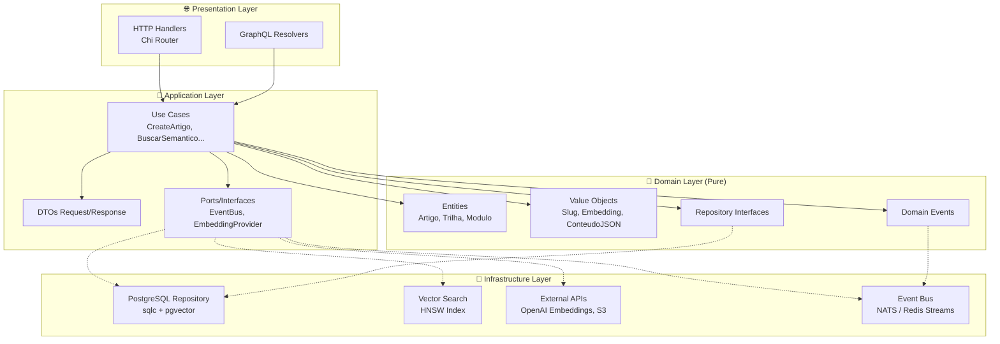
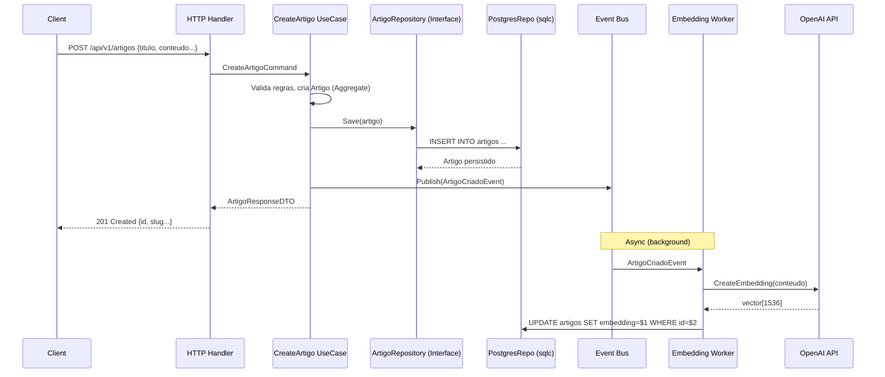
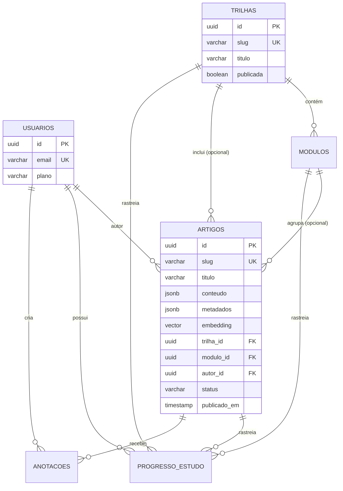

# Estudos Platform — Arquitetura de Referência

Plataforma web para estudo de TI (Arquitetura de Software, DDD, Linguagens de Programação) com foco em leitura, trilhas e busca semântica.

---

## 📐 Diagramas de Arquitetura

### Camadas DDD (Dependency Rule)



### Fluxo: Criação de Artigo + Embedding Assíncrono



### Modelo de Dados — Entidades Principais



---

## 🎯 Visão Geral

---

## 🎯 Visão Geral

| Aspecto | Decisão |
|---------|---------|
| **Frontend** | Next.js 14 (App Router) + Tailwind CSS + Shadcn/ui |
| **Backend** | **Golang 1.22+** com arquitetura DDD estrita |
| **Banco Principal** | PostgreSQL 16 + `pgvector` |
| **Busca Semântica** | Embeddings via `pgvector` (HNSW/IVFFlat) |
| **Conteúdo Dinâmico** | JSONB (artigos, anotações, metadados) |
| **Auth** | JWT + Refresh Tokens (HttpOnly cookies) |
| **Deploy** | Docker + Docker Compose (dev) / Kubernetes (prod) |

---

## 🏗️ Arquitetura — Domain-Driven Design (DDD)

```
estudos-platform/
├── cmd/api                    # Entry point (main.go, DI, config)
├── internal/
│   ├── domain/                # 🎯 CAMADA DE DOMÍNIO (pura, sem deps externas)
│   │   ├── shared/
│   │   │   ├── kernel/        # Entity, ValueObject, AggregateRoot, DomainEvent
│   │   │   └── errors/        # DomainError, códigos padronizados
│   │   └── estudos/           # Bounded Context: Estudos
│   │       ├── entity/        # Artigo, Trilha, Modulo, Progresso
│   │       ├── valueobject/   # Slug, Embedding, ConteudoJSON, Tags
│   │       ├── repository/    # Interfaces (portas) dos repositórios
│   │       └── event/         # Eventos de domínio (ArtigoPublicado, etc.)
│   │
│   ├── application/           # 🎯 CAMADA DE APLICAÇÃO (casos de uso)
│   │   └── estudos/
│   │       ├── usecase/       # CreateArtigo, BuscarSemantico, IniciarTrilha...
│   │       ├── dto/           # Request/Response DTOs
│   │       └── port/          # Ports (interfaces p/ infra: EventBus, EmbeddingProvider)
│   │
│   ├── infrastructure/        # 🔧 CAMADA DE INFRAESTRUTURA
│   │   ├── persistence/
│   │   │   ├── postgres/      # Repositórios concretos (sqlc/GORM), migrations
│   │   │   └── vector/        # pgvector helper, HNSW index management
│   │   └── external/          # OpenAI/Embedding APIs, Storage (S3/R2)
│   │
│   └── presentation/          # 🌐 CAMADA DE APRESENTAÇÃO
│       ├── http/              # Handlers, Middleware, Router (Chi/Gin)
│       └── graphql/           # (Opcional) Schema GraphQL
```

### Princípios Aplicados

| Princípio | Como Aplicamos |
|-----------|----------------|
| **Domain Isolation** | `domain/` não importa `infrastructure/` nem `presentation/` |
| **Dependency Rule** | Camadas internas não conhecem externas; inversão via interfaces (Ports) |
| **Ubiquitous Language** | Nomes em português no domínio (`Artigo`, `Trilha`, `ProgressoEstudo`) |
| **Aggregates** | `Artigo` é Aggregate Root; `Trilha` agrega `Modulo` |
| **Value Objects** | `Slug`, `Embedding`, `ConteudoJSON` — imutáveis, igualdade por valor |
| **Domain Events** | `ArtigoPublicado`, `TrilhaConcluida` — publicados via `EventBus` port |

---

## 🗄️ Modelo de Dados — PostgreSQL + pgvector

### Tabelas Relacionais (Domínio Estrito)

```sql
-- Usuários e Auth
CREATE TABLE usuarios (
    id UUID PRIMARY KEY DEFAULT gen_random_uuid(),
    email VARCHAR(255) UNIQUE NOT NULL,
    password_hash TEXT NOT NULL,
    nome VARCHAR(150) NOT NULL,
    avatar_url TEXT,
    plano VARCHAR(20) DEFAULT 'free', -- free, pro, enterprise
    created_at TIMESTAMPTZ DEFAULT now(),
    updated_at TIMESTAMPTZ DEFAULT now()
);

-- Trilhas de Estudo (Aggr. Root)
CREATE TABLE trilhas (
    id UUID PRIMARY KEY DEFAULT gen_random_uuid(),
    slug VARCHAR(200) UNIQUE NOT NULL,
    titulo VARCHAR(200) NOT NULL,
    descricao TEXT,
    capa_url TEXT,
    ordem INT DEFAULT 0,
    publicada BOOLEAN DEFAULT false,
    created_at TIMESTAMPTZ DEFAULT now(),
    updated_at TIMESTAMPTZ DEFAULT now()
);

-- Módulos (Entidade filha de Trilha)
CREATE TABLE modulos (
    id UUID PRIMARY KEY DEFAULT gen_random_uuid(),
    trilha_id UUID NOT NULL REFERENCES trilhas(id) ON DELETE CASCADE,
    slug VARCHAR(200) NOT NULL,
    titulo VARCHAR(200) NOT NULL,
    descricao TEXT,
    ordem INT DEFAULT 0,
    created_at TIMESTAMPTZ DEFAULT now(),
    UNIQUE (trilha_id, slug)
);
```

### Tabelas com JSONB + pgvector (Conteúdo Dinâmico)

```sql
-- Artigos (Aggregate Root)
CREATE TABLE artigos (
    id UUID PRIMARY KEY DEFAULT gen_random_uuid(),
    slug VARCHAR(200) UNIQUE NOT NULL,
    titulo VARCHAR(300) NOT NULL,
    subtitulo TEXT,
    capa_url TEXT,
    
    -- JSONB: corpo rico (blocks: heading, code, image, callout, etc.)
    conteudo JSONB NOT NULL DEFAULT '{}',
    
    -- JSONB: metadados flexíveis (tempo_leitura, referencias, prerequisites)
    metadados JSONB NOT NULL DEFAULT '{}',
    
    -- pgvector: embedding do conteúdo para busca semântica
    embedding VECTOR(1536), -- dimensão do modelo (ex: text-embedding-3-small)
    
    -- Relacionais
    trilha_id UUID REFERENCES trilhas(id) ON DELETE SET NULL,
    modulo_id UUID REFERENCES modulos(id) ON DELETE SET NULL,
    autor_id UUID NOT NULL REFERENCES usuarios(id),
    
    -- Estado
    status VARCHAR(20) DEFAULT 'rascunho', -- rascunho, revisao, publicado, arquivado
    publicado_em TIMESTAMPTZ,
    
    created_at TIMESTAMPTZ DEFAULT now(),
    updated_at TIMESTAMPTZ DEFAULT now()
);

-- Índice HNSW para busca vetorial performática
CREATE INDEX idx_artigos_embedding_hnsw ON artigos
USING hnsw (embedding vector_cosine_ops)
WITH (m = 16, ef_construction = 64);

-- Índice GIN para queries JSONB
CREATE INDEX idx_artigos_conteudo_gin ON artigos USING GIN (conteudo);
CREATE INDEX idx_artigos_metadados_gin ON artigos USING GIN (metadados);

-- Progresso do Usuário
CREATE TABLE progresso_estudo (
    id UUID PRIMARY KEY DEFAULT gen_random_uuid(),
    usuario_id UUID NOT NULL REFERENCES usuarios(id) ON DELETE CASCADE,
    trilha_id UUID NOT NULL REFERENCES trilhas(id) ON DELETE CASCADE,
    modulo_id UUID REFERENCES modulos(id) ON DELETE CASCADE,
    artigo_id UUID REFERENCES artigos(id) ON DELETE CASCADE,
    concluido BOOLEAN DEFAULT false,
    percentual INT DEFAULT 0,
    updated_at TIMESTAMPTZ DEFAULT now(),
    UNIQUE (usuario_id, trilha_id, modulo_id, artigo_id)
);

-- Anotações do Usuário (JSONB flexível)
CREATE TABLE anotacoes (
    id UUID PRIMARY KEY DEFAULT gen_random_uuid(),
    usuario_id UUID NOT NULL REFERENCES usuarios(id) ON DELETE CASCADE,
    artigo_id UUID NOT NULL REFERENCES artigos(id) ON DELETE CASCADE,
    conteudo JSONB NOT NULL DEFAULT '{}', -- { highlights: [], notes: [], bookmarks: [] }
    created_at TIMESTAMPTZ DEFAULT now(),
    updated_at TIMESTAMPTZ DEFAULT now()
);
```

---

## 🔍 Busca Semântica com pgvector

```go
// internal/infrastructure/persistence/vector/search.go
package vector

import (
	"context"
	"github.com/pgvector/pgvector-go"
	"github.com/jackc/pgx/v5/pgxpool"
)

type VectorSearch struct {
	pool *pgxpool.Pool
	dim  int // 1536 para text-embedding-3-small
}

func NewVectorSearch(pool *pgxpool.Pool, dim int) *VectorSearch {
	return &VectorSearch{pool: pool, dim: dim}
}

// Busca por similaridade de cosseno (KNN)
func (v *VectorSearch) SearchSimilar(ctx context.Context, queryEmbedding []float32, limit int) ([]ArtigoResult, error) {
	if len(queryEmbedding) != v.dim {
		return nil, ErrDimensionMismatch(v.dim, len(queryEmbedding))
	}
	
	vec := pgvector.NewVector(queryEmbedding)
	
	rows, err := v.pool.Query(ctx, `
		SELECT id, slug, titulo, subtitulo, capa_url, 
		       1 - (embedding <=> $1) AS similarity
		FROM artigos
		WHERE status = 'publicado' AND embedding IS NOT NULL
		ORDER BY embedding <=> $1
		LIMIT $2
	`, vec, limit)
	
	// ... scan rows
}
```

**Configuração do Índice HNSW** (produção):
```sql
-- m=16, ef_construction=64 → bom equilíbrio recall/performance
-- Ajuste ef_search em runtime: SET hnsw.ef_search = 100;
```

---

## 📦 Estrutura do Aggregate `Artigo`

```
Artigo (Aggregate Root)
├── ID: UUID
├── Slug: Slug (VO)
├── Titulo: string
├── Subtitulo: string (opcional)
├── CapaURL: string (opcional)
├── Conteudo: ConteudoJSON (VO)      -- JSONB: blocks ricos
├── Metadados: MetadadosArtigo (VO)  -- JSONB: tempo_leitura, tags, refs
├── Embedding: Embedding (VO)        -- VECTOR(1536) para pgvector
├── TrilhaID: UUID (opcional)
├── ModuloID: UUID (opcional)
├── AutorID: UUID
├── Status: ArtigoStatus (VO)        -- rascunho | revisao | publicado | arquivado
├── PublicadoEm: *time.Time
├── CreatedAt: time.Time
├── UpdatedAt: time.Time
└── DomainEvents: []DomainEvent      -- ArtigoPublicado, ArtigoAtualizado
```

**Regras de Negócio (Invariantes)**:
- `Publicar()` só permitido se `Status == Revisao` e `Conteudo` não vazio
- `AtualizarConteudo()` recalcula `Embedding` assincronamente via event handler
- `Slug` imutável após primeira publicação (redirects via tabela separada)

---

## 🔄 Fluxo de Dados — Vertical Slice (Ex: Criar Artigo)

```
POST /api/v1/artigos
       │
       ▼
┌──────────────────┐
│  HTTP Handler    │  ← Presentation: binding, validação de borda
│  (Chi router)    │
└────────┬─────────┘
         │ CreateArtigoCommand (DTO)
         ▼
┌──────────────────┐
│  Use Case        │  ← Application: orquestração, transação
│  CreateArtigo    │
└────────┬─────────┘
         │ Artigo (Entity) + Domain Events
         ▼
┌──────────────────┐
│  ArtigoRepository│  ← Domain: Interface (Port)
│  (Interface)     │
└────────┬─────────┘
         │ Implementação concreta
         ▼
┌──────────────────┐
│  PostgresRepo    │  ← Infrastructure: sqlc/GORM + pgvector
│  (sqlc)          │
└────────┬─────────┘
         │ INSERT + Event Bus publish
         ▼
┌──────────────────┐
│  Event Handler   │  ← Async: gera embedding via OpenAI API
│  (Background)    │     atualiza artigo.embedding
└──────────────────┘
```

---

## ⚙️ Configuração & Execução

### Variáveis de Ambiente (`.env`)

```env
# App
APP_ENV=development
APP_PORT=8080
APP_URL=http://localhost:8080

# Database
DB_HOST=localhost
DB_PORT=5432
DB_USER=estudos
DB_PASSWORD=estudos_dev
DB_NAME=estudos_platform
DB_SSL_MODE=disable
DB_MAX_OPEN_CONNS=25
DB_MAX_IDLE_CONNS=5

# pgvector
VECTOR_DIM=1536

# Auth
JWT_SECRET=super-secret-change-in-prod
JWT_ACCESS_TTL=15m
JWT_REFRESH_TTL=168h

# Embedding Provider (OpenAI / Local)
EMBEDDING_PROVIDER=openai
OPENAI_API_KEY=sk-...
EMBEDDING_MODEL=text-embedding-3-small

# Storage (S3/R2)
S3_ENDPOINT=https://xxx.r2.cloudflarestorage.com
S3_ACCESS_KEY=...
S3_SECRET_KEY=...
S3_BUCKET=estudos-platform
```

### Docker Compose (Desenvolvimento)

```yaml
# docker-compose.yml
version: '3.8'

services:
  postgres:
    image: pgvector/pgvector:pg16
    environment:
      POSTGRES_DB: estudos_platform
      POSTGRES_USER: estudos
      POSTGRES_PASSWORD: estudos_dev
    ports: ["5432:5432"]
    volumes:
      - pgdata:/var/lib/postgresql/data
      - ./migrations:/docker-entrypoint-initdb.d
    healthcheck:
      test: ["CMD-SHELL", "pg_isready -U estudos"]
      interval: 5s
      timeout: 5s
      retries: 5

  api:
    build:
      context: .
      dockerfile: Dockerfile.dev
    environment:
      - DB_HOST=postgres
      - DB_PORT=5432
      - DB_USER=estudos
      - DB_PASSWORD=estudos_dev
      - DB_NAME=estudos_platform
    ports: ["8080:8080"]
    depends_on:
      postgres:
        condition: service_healthy
    volumes:
      - .:/app
    command: air -c .air.toml

volumes:
  pgdata:
```

```dockerfile
# Dockerfile.dev
FROM golang:1.22-alpine

RUN apk add --no-cache git bash make
RUN go install github.com/air-verse/air@latest
RUN go install github.com/sqlc-dev/sqlc/cmd/sqlc@latest

WORKDIR /app
CMD ["air", "-c", ".air.toml"]
```

### Makefile (Comandos Principais)

```makefile
# make help
.PHONY: help
help:
	@grep -E '^[a-zA-Z_-]+:.*?## .*$$' $(MAKEFILE_LIST) | awk 'BEGIN {FS = ":.*?## "}; {printf "\033[36m%-20s\033[0m %s\n", $$1, $$2}'

# make dev          ## Sobe stack completa (postgres + api hot-reload)
dev:
	docker compose up --build

# make migrate      ## Roda migrations (sqlc + golang-migrate)
migrate:
	sqlc generate
	go run cmd/migrate/main.go up

# make generate     ## Gera código (sqlc, mocks)
generate:
	sqlc generate
	go generate ./...

# make test         ## Testes unitários + integração
test:
	go test -v -race -count=1 ./internal/...

# make lint         ## GolangCI-Lint
lint:
	golangci-lint run ./...

# make build        ## Build binário de produção
build:
	CGO_ENABLED=0 go build -ldflags="-s -w" -o bin/api ./cmd/api
```

---

## 📐 Decisões de Design — Resumo

| Decisão | Justificativa |
|---------|---------------|
| **Golang + DDD** | Performance nativa, concorrência (goroutines) ideal para embedding async, tipagem forte para domínio rico |
| **sqlc > GORM** | SQL type-safe, zero reflection, queries explícitas, performance previsível |
| **pgvector HNSW** | Busca ANN sub-linear, recall > 95% com ef_search=100, nativo no Postgres |
| **JSONB para conteúdo** | Flexibilidade de blocos ricos (Notion-style), GIN index para queries, sem migrations por campo novo |
| **Chi Router** | Leve, middleware chain padrão Go, compatível com `net/http` |
| **Event-driven embedding** | Desacopla escrita da geração de vetor (custosa), retry natural via outbox pattern |
| **Slug como VO** | Garante URLs canônicas, imutável após publicação, normalização centralizada |
| **Aggregate Root: Artigo** | Consistência transacional de conteúdo + metadados + embedding |

---

## 🖼️ Assets Visuais (Opcional)

Coloque arquivos de imagem em `docs/assets/` e referencie no README:

```
estudos-platform/
├── docs/
│   └── assets/
│       ├── architecture-overview.png      # Diagrama geral (export do Mermaid/Figma)
│       ├── ddd-layers.png                 # Camadas DDD
│       ├── data-model.png                 # Modelo ER
│       ├── semantic-search-flow.png       # Fluxo busca vetorial
│       └── ui-mockups/                    # Telas do Figma
│           ├── home-dark.png
│           ├── artigo-leitura.png
│           └── trilha-progresso.png
```

**Referência no Markdown:**
```markdown


```

> Os diagramas Mermaid acima já renderizam nativamente no GitHub/GitLab. Use imagens PNG/SVG para mockups de UI, diagramas complexos do Figma, ou exports de alta resolução para documentação offline.

---

## 📚 Referências

- [Domain-Driven Design (Evans)](https://martinfowler.com/bliki/DomainDrivenDesign.html)
- [pgvector Documentation](https://github.com/pgvector/pgvector)
- [sqlc — Type-safe SQL](https://sqlc.dev)
- [Chi Router](https://github.com/go-chi/chi)
- [Go Clean Architecture](https://github.com/bxcodec/go-clean-arch)

---

