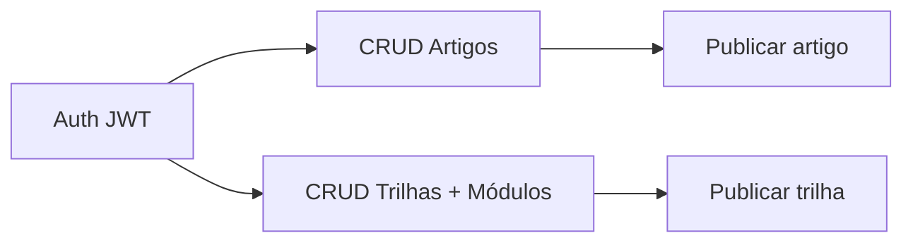
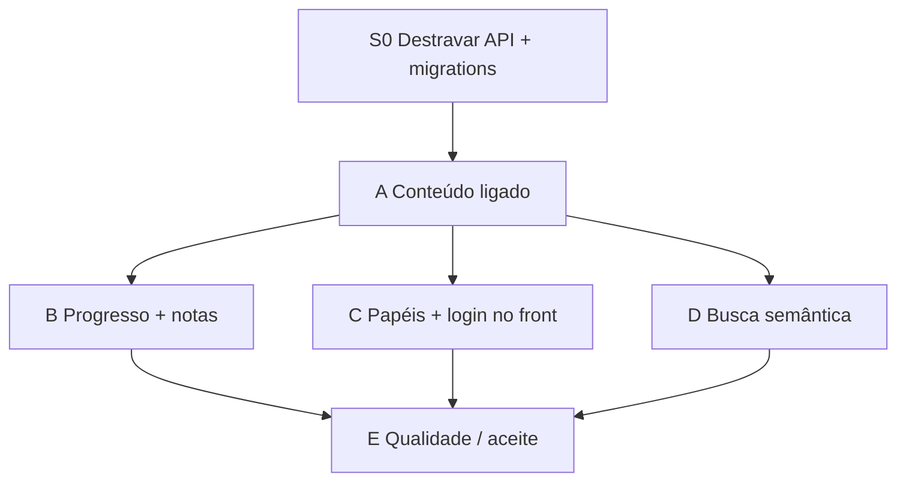

# Mapa de Features — Fechar o Sistema

Plano de trabalho para **Thiago** e **Bruno** encerrarem o MVP da Estudos Platform.

| Item | Valor |
|------|--------|
| Branch base | `dev` |
| API | `estudos-platform/backend-platform` |
| Collection | `estudos-platform/bruno` |
| Stack alvo | Go + Postgres/pgvector + Next.js |

---

## 1. O que já está pronto



| Feature | Endpoints | Quem entregou |
|---------|-----------|---------------|
| Health | `GET /health` | Sprint 1 |
| Registrar / Login / Refresh / Me | `/api/v1/auth/*` | Sprint 1 + #5 |
| CORS | middleware | #6 |
| Logout | `POST /auth/logout` | #7 |
| Artigos | `GET/POST /artigos`, `PUT`, `publicar` | #8 |
| Trilhas + módulos | `GET/POST /trilhas`, módulos, publicar | #9 |
| Collection Bruno + aula | `bruno/`, `docs/` | #9 / #10 |

**Ainda não existe no código:** vínculo artigo↔trilha, progresso, anotações, busca semântica, frontend.

---

## 2. Como dividir

| Sócio | Foco | Por quê |
|-------|------|---------|
| **Thiago** | Backend DDD, persistência, auth/segurança, embeddings | domínio técnico / veto de arquitetura |
| **Bruno** | Frontend, collection Bruno, seed/conteúdo, QA ponta a ponta | validar produto e experiência |

Regra: **ninguém mergeia em `dev` sem a API compilando** (`go test ./internal/...` + `go build ./cmd/api`).

---

## 3. Sprints para fechar

### Sprint 0 — Destravar (hoje) — juntos

| ID | Tarefa | Dono | Pronto quando |
|----|--------|------|----------------|
| S0-1 | Unificar `router.go` + `Makefile` após merge | Thiago | `go build ./cmd/api` passa |
| S0-2 | Rodar migrations 0001+0002+0003 | Bruno | `\dt` lista `usuarios`, `artigos`, `trilhas`, `modulos` |
| S0-3 | Collection Bruno: Health → Registrar → Login → Me | Bruno | 200/201 no Bruno |
| S0-4 | Fluxo trilha + artigo no Bruno | Bruno | criar/publicar/listar ok |

**Windows (migrations):**

```powershell
cd estudos-platform\backend-platform
docker compose up -d
.\scripts\migrate-up.ps1
go run ./cmd/api
```

---

### Sprint A — Ligar o conteúdo (core do produto)

Sem isso a plataforma não é “estudos”, são CRUDs soltos.

| ID | Feature | Dono | Escopo | API sugerida |
|----|---------|------|--------|--------------|
| A1 | Artigo pertence a trilha/módulo | Bruno | `trilha_id`, `modulo_id` opcionais no artigo + validar que módulo é da trilha | `POST /artigos` aceita IDs; `GET /trilhas/{slug}` lista artigos do módulo |
| A2 | Listar artigos da trilha | Bruno | query por `trilha_id` / `modulo_id` | `GET /trilhas/{slug}/artigos` |
| A3 | Seed de 1 trilha + 2 módulos + 3 artigos | Thiago | SQL ou script + requests Bruno | dados visíveis no listar público |

**Invariantes:** artigo publicado só aparece se a trilha estiver publicada (quando vinculado). Slug continua único.

---

### Sprint B — Aluno (progresso + anotações)

| ID | Feature | Dono | Escopo | API sugerida |
|----|---------|------|--------|--------------|
| B1 | Marcar artigo como lido | Thiago | tabela `progresso_estudo` | `PUT /progresso/artigos/{id}` `{ "concluido": true }` |
| B2 | Progresso da trilha | Thiago | % = artigos concluídos / total da trilha | `GET /progresso/trilhas/{id}` |
| B3 | Anotações no artigo | Bruno | JSONB `highlights` / `notes` | `PUT /artigos/{id}/anotacoes` |

---

### Sprint C — Auth de produto + papéis

| ID | Feature | Dono | Escopo |
|----|---------|------|--------|
| C1 | Papel `aluno` / `autor` / `admin` | Bruno | só autor/admin cria e publica |
| C2 | Cookies HttpOnly (access + refresh) | Thiago | parar de devolver token no JSON para o browser |
| C3 | Rate limit em `/auth/*` | Thiago | 10 req/min por IP |


---

### Sprint D — Busca semântica (diferencial)

| ID | Feature | Dono | Escopo |
|----|---------|------|--------|
| D1 | Coluna `embedding VECTOR(1536)` em artigos | Thiago | migration 0004 + índice HNSW |
| D2 | Worker ao publicar | Thiago | gera embedding (OpenAI ou stub local) |
| D3 | `GET /busca?q=` | Thiago | cosine + fallback ILIKE se embedding nulo |


Enquanto a chave OpenAI não existir: stub que preenche vetor zero e busca por título.

---

### Sprint E — Fechar MVP (qualidade)

| ID | Feature | Dono | Escopo |
|----|---------|------|--------|
| E1 | Migrator (`golang-migrate`) | Thiago | abandonar `docker exec` no dia a dia |
| E2 | Testes de integração Postgres | Thiago | pelo menos register + criar artigo |
| E3 | Erro claro se tabela não existe | Thiago | não mascarar como “falha ao verificar e-mail” |
| E4 | README único “como rodar no Windows” | Bruno | compose + `.env` + migrate-up.ps1 + Bruno |
| E5 | Checklist de aceite no Bruno | Bruno | pasta `04-aceitacao/` com o fluxo feliz |

---

## 4. Ordem (não pular)



D pode começar em paralelo depois de A1 (artigo já tem ID estável).  
Frontend (A4/C4) começa assim que A1 estiver no `dev`.

---

## 5. Definição de “sistema fechado”

O MVP está fechado quando **os dois** conseguem, sem Docker trick e sem Postman avulso:

1. Subir Postgres + API no Windows  
2. Registrar / logar no front  
3. Ver uma trilha publicada com módulos e artigos  
4. Abrir um artigo, marcar como lido, salvar uma anotação  
5. Ver % da trilha atualizar  
6. Buscar um termo e achar o artigo (mesmo que stub no começo)  
7. Logout e não conseguir refresh  

Collection Bruno cobre 1–7 mesmo antes do front ficar bonito.

---

## 6. Contratos rápidos (para não divergir)

**Artigo (depois de A1)**

```json
{
  "titulo": "DDD na Prática",
  "slug": "ddd-na-pratica",
  "trilha_id": "uuid",
  "modulo_id": "uuid",
  "conteudo": { "blocks": [] },
  "metadados": { "tags": ["ddd"] }
}
```

**Progresso (B1)**

```json
{ "artigo_id": "uuid", "concluido": true }
```

**Busca (D3)**

```json
{ "itens": [{ "slug": "ddd-na-pratica", "titulo": "...", "similarity": 0.82 }] }
```

---

## 7. Quadro Kanban (copiar pro GitHub Projects / Notion)

| Backlog | Thiago | Bruno | Done |
|---------|--------|-------|------|
| A1 A2 B1 B2 B3 C1 C2 C3 D1 D2 D3 E1 E2 E3 | S0-1 | S0-2 S0-3 S0-4 A3 A4 B4 C4 C5 D4 E4 E5 | Auth, Artigos, Trilhas, CORS, Logout, Bruno collection |

---

## 8. PRs — um por ID

Mesmo padrão que funcionou: **1 feature = 1 branch = 1 commit = 1 PR contra `dev`**.

Exemplos:

- `feat/artigos-vincular-trilha` (A1)  
- `feat/progresso-estudo` (B1+B2)  
- `feat/frontend-leitura` (A4)  

Não misturar frontend e migration no mesmo PR.
