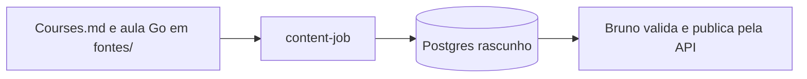
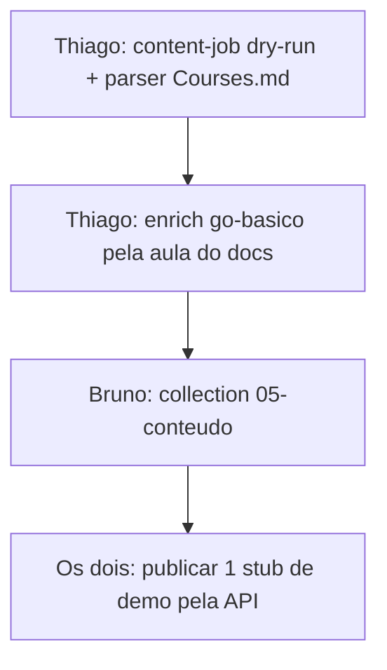

# Job de Conteúdo — Spec

Como a plataforma ganha aulas **sem o time escrever curso** e **sem pagar API de IA**.

Quem usa a plataforma (Bruno, Mariana, aluno) **não redige aula, quiz nem Markdown pedagógico**.  
Quem escreve código do job: **Thiago**.

| Item | Valor |
|------|--------|
| Branch base | `dev` |
| Binário | `estudos-platform/backend-platform/cmd/content-job` |
| Fontes | `fontes/Courses.md` + `fontes/AULA-CODE-REVIEW-GO-SPRINT.md` |
| Saída gerada (opcional) | `estudos-platform/content/generated/` — só leitura |
| Collection | `estudos-platform/bruno/05-conteudo/` |
| Custo | **R$ 0** — sem OpenAI, sem agente em produção |
| Dono do job | Thiago |
| Dono do catálogo de links | Mariana (`Courses.md`) |
| Dono do aceite | Bruno (Bruno app + checklist) |

Leia inteiro antes de criar arquivo. O job **não inventa tema**. Só transforma o que já está no Git.

---

## 1. O que é (e o que não é)



**É:** importador idempotente. Lê Markdown do repo, monta trilha / módulo / artigo / quiz-template, grava **rascunho**.

**Não é:**

- alguém do time virando autor de curso
- ChatGPT / Claude / Cursor API em produção
- copiar texto de Alura, DIO, LinkedIn Learning
- publicar sozinho em produção
- tutor de IA no aluno

Cursor pode ser usado **uma vez, pelo Thiago**, para implementar o parser. Não para o Bruno “gerar 80 aulas”.

---

## 2. Por que o time não escreve aula

Não somos um time de instrutores. Pedir 6 Markdowns de Go + 18 questões é o job falhar.

O que escala a R$ 0:

| Entrada (já existe) | O job faz |
|---------------------|-----------|
| `fontes/Courses.md` | 1 trilha por `##` categoria, 1 artigo por linha da tabela |
| `fontes/AULA-CODE-REVIEW-GO-SPRINT.md` | preenche a trilha **já seedada** `go-basico` com texto **nosso** (doc da aula) |
| Template Go no código | `objetivo`, checklist, bloco `resource` (o link), quiz padrão |

Humano só:

1. Mariana atualiza a **tabela de links** no `Courses.md` (título + URL + seção).
2. Bruno roda o job / collection e **publica** o que estiver ok.
3. Thiago corrige o parser se o MD mudar de formato.

Ninguém preenche `## Conceito` na mão.

---

## 3. Divisão

| Quem | Faz | Não faz |
|------|-----|---------|
| **Thiago** | `cmd/content-job`, parser, upsert, `--dry-run`, testes, template JSONB | redação de aula |
| **Mariana** | linhas novas no `Courses.md` | YAML pedagógico, quiz, Go |
| **Bruno** | collection `05-conteudo/`, dry-run, publicar 1 artigo de demo | implementar o binário, escrever `.md` de aula |

PRs separados:

- `feat/content-job` — só código Go (Thiago)
- `feat/bruno-conteudo` — collection de aceite (Bruno)

**Não** existe PR `feat/content-go-basico` com 6 aulas escritas à mão.

Ninguém mergeia em `dev` com a API quebrada (`go test ./internal/...` + `go build ./cmd/api`).

---

## 4. Pastas (um nome só)

```
estudos-platform/
├── fontes/
│   ├── Courses.md                      # fonte — Mariana
│   ├── AULA-CODE-REVIEW-GO-SPRINT.md   # fonte — go-basico
│   └── README.md
├── documentacao/
│   └── JOB-CONTEUDO.md                 # este spec
├── content/
│   └── generated/                      # o job escreve; não editar
├── backend-platform/
│   └── cmd/content-job/
└── bruno/
    └── 05-conteudo/
```

O job **não** espera `content/lessons/*.md` escrito por humano.

---

## 5. Comando (Windows) — único

```powershell
cd estudos-platform\backend-platform

# só valida
go run ./cmd/content-job --dry-run

# grava rascunhos
go run ./cmd/content-job
```

| Flag | Default | Efeito |
|------|---------|--------|
| `--dry-run` | `false` | valida e imprime; **não grava** |
| `--autor-email` | `autor.seed@estudos.local` | dono dos artigos (seed `0004`) |
| `--skip-catalogo` | `false` | não lê `Courses.md` |
| `--skip-aula-go` | `false` | não enriquece `go-basico` |
| `--publicar` | — | **não existe**. Publicar = API |

Caminhos relativos ao repo (fixos no código, sem o Bruno passar YAML de aula):

- catálogo: `../fontes/Courses.md`
- aula Go: `../fontes/AULA-CODE-REVIEW-GO-SPRINT.md`

---

## 6. O que o job gera

### 6.1 A partir do `Courses.md`

Cada `##` vira trilha:

| Heading no MD | `slug` da trilha |
|---------------|------------------|
| Dados | `dados` |
| SRE / Infraestrutura | `sre-infra` |
| Desenvolvimento | `desenvolvimento` |
| SAP | `sap` |
| Ferramentas | `ferramentas` |

Cada linha `| Título \| [Acessar](url) |`:

- artigo `slug` = slug do título (único global)
- 1 módulo `catalogo` por trilha (ordem 0)
- `prereqs` vazio (fase 1)
- **não** copia o conteúdo do curso; o link é o material

Corpo JSONB (tipos que o banco/API já usam — `p`, não `paragraph`):

```json
{
  "blocks": [
    { "type": "h", "level": 2, "text": "Objetivo" },
    { "type": "p", "text": "Estudar o material indicado e conseguir explicar o tema em uma frase." },
    { "type": "h", "level": 2, "text": "Material" },
    { "type": "p", "text": "Fonte: SPARK" },
    { "type": "p", "text": "https://lnkd.in/..." },
    { "type": "h", "level": 2, "text": "Checkpoint" },
    { "type": "p", "text": "1) Abri o link. 2) Anotei o assunto em uma frase. 3) Marquei como lido na plataforma." }
  ]
}
```

`metadados`:

```json
{
  "tempo_leitura_min": 10,
  "objetivo": "Estudar SPARK a partir da fonte do catálogo",
  "tags": ["dados"],
  "origem": "courses-md",
  "fontes": [{ "titulo": "SPARK", "url": "https://..." }],
  "quiz": {
    "questoes": [
      {
        "id": "q1",
        "enunciado": "Você abriu o material SPARK?",
        "opcoes": [
          { "id": "a", "texto": "Sim" },
          { "id": "b", "texto": "Ainda não" },
          { "id": "c", "texto": "Link quebrado" }
        ],
        "correta": "a",
        "explicacao": "O checkpoint desta fase é acessar a fonte. Conteúdo do curso pago não é copiado."
      },
      {
        "id": "q2",
        "enunciado": "Você consegue dizer o assunto principal em uma frase?",
        "opcoes": [
          { "id": "a", "texto": "Sim" },
          { "id": "b", "texto": "Ainda não" },
          { "id": "c", "texto": "Não era o tema desta trilha" }
        ],
        "correta": "a",
        "explicacao": "A nota do catálogo classifica pelo assunto principal."
      },
      {
        "id": "q3",
        "enunciado": "Este nó substitui o curso original?",
        "opcoes": [
          { "id": "a", "texto": "Sim, a aula está toda aqui" },
          { "id": "b", "texto": "Não — o link é a aula; aqui é o mapa e o progresso" },
          { "id": "c", "texto": "Só se pagar a API de IA" }
        ],
        "correta": "b",
        "explicacao": "A plataforma organiza o caminho. O material continua no link."
      }
    ]
  }
}
```

Quiz desta fase é **checklist de estudo**, não prova de Spark. Não fingimos que somos autores do curso.

Título duplicado em duas categorias → **um** artigo, tags das duas trilhas (ou o job loga e reusa o slug). Não duplicar.

### 6.2 A partir da aula Go (trilha seed)

Trilha **já existe**: slug `go-basico`, id `22222222-2222-2222-2222-222222222222`, **já publicada**.

Módulos seed (não renomear):

| slug | id |
|------|-----|
| `sintaxe` | `33333333-3333-3333-3333-333333333333` |
| `interfaces` | `44444444-4444-4444-4444-444444444444` |

Artigos seed (upsert por slug; **não criar slug novo**):

| slug | módulo |
|------|--------|
| `pacotes-em-go` | `sintaxe` |
| `structs-e-metodos` | `sintaxe` |
| `interfaces-implicitas` | `interfaces` |

O job **fatia** `AULA-CODE-REVIEW-GO-SPRINT.md` por `##` / `###` e associa por palavra-chave:

| slug | pega seções cujo título contém |
|------|--------------------------------|
| `pacotes-em-go` | `pacote`, `package`, `internal/` |
| `structs-e-metodos` | `struct`, `método`, `receiver` |
| `interfaces-implicitas` | `interface` |

Texto copiado é **nosso** (doc da aula do repo). Exemplo de código pode citar `internal/...`.

Esses 3 artigos no seed já estão **`publicado`**. O job **atualiza o JSONB e não volta o status**. Por isso o recorte das seções tem que ser do arquivo versionado, não de rascunho solto.

Não criar aulas 4–6 de Go neste recorte. Três nós ricos + catálogo da Mariana > seis aulas fantasmas escritas à mão.

---

## 7. Upsert

| Entidade | Chave | Se existe | Se não existe |
|----------|-------|-----------|----------------|
| Trilha | `slug` | atualiza título, descrição, ordem. **Não mexe em `publicada`** | `publicada = false` |
| Módulo | `(trilha_id, slug)` | atualiza título, descrição, ordem | cria |
| Artigo | `slug` | atualiza título, conteúdo, metadados, `trilha_id`, `modulo_id`. **Não muda `status` se já for `publicado`** | `rascunho` |

Rodar 10 vezes = mesmo estado. Sem slug duplicado.

O job **para** se:

- MD sem tabela parseável
- URL vazia numa linha
- slug de artigo vazio
- arquivo de aula Go ausente (quando `--skip-aula-go` é false)
- nenhuma seção casou com os 3 slugs seed (quando não skip)

`--dry-run` acusa o mesmo **sem gravar**.

O job **não**:

- gera prosa com LLM
- chama embedding / OpenAI (stub continua)
- publica
- apaga artigo que saiu do MD (loga órfão)
- lê pasta `content/lessons/` humana

---

## 8. Contrato com a API de hoje

Prefixo: `/api/v1`.

| Ação | Request real |
|------|----------------|
| Health | `GET /health` |
| Login seed | `POST /api/v1/auth/login` |
| Trilha | `GET /api/v1/trilhas/go-basico` |
| Artigo | `GET /api/v1/artigos/pacotes-em-go` |
| Listar | `GET /api/v1/artigos` |
| Publicar | `POST /api/v1/artigos/{id}/publicar` |
| Marcar lido | `PUT /api/v1/progresso/artigos/{id}` |
| % da trilha | `GET /api/v1/progresso/trilhas/{id}` |

Não usar `GET /artigos/{id}` nem `GET /trilhas?slug=`.

Seed (`0004`):

| Campo | Valor |
|-------|--------|
| e-mail | `autor.seed@estudos.local` |
| senha | `senha1234` |

Não commitar senha nova. Não trocar o hash neste PR.

JSONB do artigo depois do job:

```json
{
  "slug": "pacotes-em-go",
  "status": "publicado",
  "trilha_id": "22222222-2222-2222-2222-222222222222",
  "modulo_id": "33333333-3333-3333-3333-333333333333",
  "conteudo": {
    "blocks": [
      { "type": "h", "level": 2, "text": "Objetivo" },
      { "type": "p", "text": "..." }
    ]
  },
  "metadados": {
    "tempo_leitura_min": 10,
    "objetivo": "...",
    "tags": ["go"],
    "fontes": [{ "titulo": "...", "url": "https://go.dev/..." }],
    "quiz": { "questoes": [] }
  }
}
```

Front (quando existir): renderiza `blocks` na ordem; quiz só UI. Marcar lido = `PUT /progresso/artigos/{id}`. Corrigir quiz no servidor = sprint futuro.

---

## 9. Recorte desta entrega

**Fase 1 (este job)**

1. Parser `Courses.md` → trilhas + artigos rascunho (stubs com link).
2. Enrich `go-basico` seed a partir da aula Go em `fontes/`.
3. Collection Bruno do fluxo feliz.
4. `--dry-run` + segunda execução sem duplicar.

**Fase 2 (depois)**  
Filtro no `Courses.md`: linhas de ferramenta pura (Excalidraw) não viram nó de trilha — tag `ferramenta`. Só quando Mariana responder o que **não** é aula.

**Fase 3 (opcional, ainda R$ 0)**  
Ollama **local** para reescrever o stub. Continua rascunho. Fora deste PR. Sem Ollama, o template da seção 6.1 vale.

**Fora:** runner de código, XP, chat no aluno, scrape de `lnkd.in`.

---

## 10. Fontes permitidas vs proibidas

| Pode | Não pode |
|------|----------|
| `fontes/Courses.md` (link + título) | colar capítulo de curso pago |
| `fontes/AULA-CODE-REVIEW-GO-SPRINT.md` | inventar API que não existe no backend |
| go.dev, postgres.org (URL no metadado) | print de slide de terceiro |

O job **não baixa** o HTML do LinkedIn para virar parágrafo.

---

## 11. Como o Bruno trabalha (sem escrever aula)

1. `docker compose up -d` + `go run ./cmd/migrate`
2. `go run ./cmd/content-job --dry-run`
3. Se ok: `go run ./cmd/content-job`
4. Collection `05-conteudo/` (seção 12)
5. Publicar **um** artigo de demo pela API
6. PR só da collection, se o job já estiver no `dev`

Se o binário ainda não estiver no `dev`, Bruno **não** inventa Markdown. Espera o PR do Thiago.

---

## 12. Collection `bruno/05-conteudo/`

| # | Request | Pronto quando |
|---|---------|----------------|
| 01 | Health | 200 |
| 02 | Login seed | 200 |
| 03 | `GET /api/v1/trilhas/go-basico` | 2 módulos `sintaxe`, `interfaces` |
| 04 | `GET /api/v1/artigos/pacotes-em-go` | `conteudo.blocks` com `h`/`p`; não é mais só uma linha |
| 05 | `GET /api/v1/artigos` | slugs do catálogo (ex. `spark`) em rascunho |
| 06 | `GET /api/v1/trilhas/dados` | trilha existe após o job |
| 07 | Confirmar artigos **novos** do catálogo com `status = rascunho` | job não publicou |
| 08 | `POST /api/v1/artigos/{id}/publicar` **um** de demo | 200, passo manual |
| 09 | Rodar o job de novo + GET | mesmos IDs, sem duplicar slug |
| 10 | `PUT /api/v1/progresso/artigos/{id}` + `GET .../progresso/trilhas/{id}` | % muda |

---

## 13. Checklist de aceite

Job:

- [ ] `--dry-run` passa no Windows
- [ ] segunda execução não duplica slug
- [ ] artigos novos do `Courses.md` nascem `rascunho`
- [ ] trilha `go-basico` **não** foi despublicada
- [ ] `pacotes-em-go`, `structs-e-metodos`, `interfaces-implicitas` continuam os mesmos slugs
- [ ] zero pasta `content/lessons/` preenchida por humano

Produto:

- [ ] dá para abrir um nó de Dados, clicar no link da Mariana, marcar lido
- [ ] dá para abrir `pacotes-em-go` e ver texto da aula do repo
- [ ] collection `05-conteudo/` passa a seção 12

---

## 14. Definição de “job fechado”

No Windows, sem Postman avulso:

1. Subir Postgres + API  
2. Rodar `content-job`  
3. Ver trilhas do catálogo + `go-basico` com 2 módulos e 3 artigos seed  
4. Abrir um stub e um artigo Go no GET por **slug**  
5. Rodar de novo sem duplicar  
6. Publicar **um** item pela API, não pelo job  

Gamificação e correção de quiz no servidor **não** entram.

---

## 15. Ordem na semana



Bruno **não** começa o sprint escrevendo `.md`. Começa quando o dry-run existir.

---

## 16. FAQ

**O Bruno manda o Cursor escrever as aulas?**  
Não. Não há aulas para escrever. O Cursor no máximo implementa o parser, no PR do Thiago.

**E Dados / SAP / SRE?**  
Entram no mesmo job, como stub + link, na fase 1. Não são “curso Go” disfarçado.

**E se quisermos 20 aulas originais de Go?**  
Outro produto (redação). Fora deste job.

**`publicada: true` no YAML?**  
Não há YAML de aula. Publicar = request.

**Quem revisa o texto do go-basico?**  
O texto já é o doc da aula no Git. Thiago veta se o recorte por keyword pegou a seção errada (ajuste no mapa do parser, não redação nova).

**Ollama?**  
Só fase 3, local, opcional. Sem isso o stub + link já é o MVP do catálogo.

---

## 17. Referência

| Doc / código | Para quê |
|--------------|----------|
| [MAPA-FEATURES-FECHAR-SISTEMA.md](./MAPA-FEATURES-FECHAR-SISTEMA.md) | sprints; este job é o A3 automático |
| [Courses.md](./Courses.md) | fonte do catálogo |
| [AULA-CODE-REVIEW-GO-SPRINT.md](./AULA-CODE-REVIEW-GO-SPRINT.md) | fonte do go-basico |
| [PARA-MARIANA-CATALOGO-E-ROADMAPS.md](./PARA-MARIANA-CATALOGO-E-ROADMAPS.md) | o que pedimos dela (só a tabela) |
| `migration/0004_seed_conteudo.up.sql` | slugs e IDs |
| use cases de artigo/trilha | job chama a aplicação, não SQL solto |
